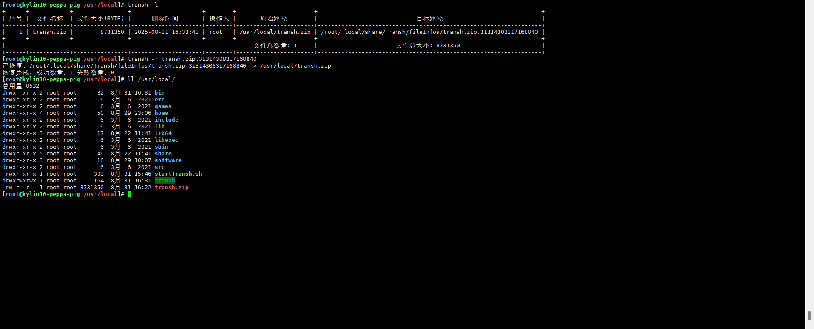
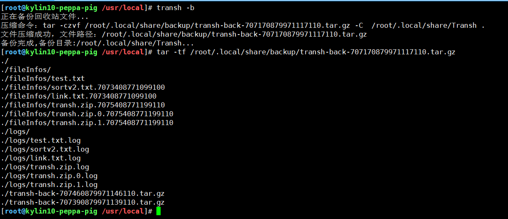
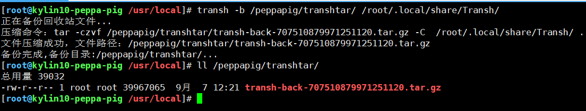

# 一、 先谈谈为啥我要开发这个东西？

  我是在学习运维的时候发现rm操作比较危险的操作，就想着开发一款适用于Linux回收站的功能 ，可以实时将文件进行回滚，在紧急关头挽回运维的命。回收站也会支持数据的实时备份、压缩存储等。

# 二、项目简介

目标实现的功能如下：

|        功能        |         是否开发完毕         |
| :----------------: | :--------------------------: |
|  将文件放入回收站  |            已完成            |
|      数据恢复      |            已完成            |
|     清空回收站     |            已完成            |
|   查看回收站内容   |            已完成            |
| 删除回收站指定内容 |          正在开发中          |
|   回收站数据备份   |            已完成            |
|   对数据进行压缩   | 已完成（仅支持gzip压缩格式） |
|     集成rm命令     |                              |

# 三、安装方法

```bash
# 方法一
# 可以直接获取一键安装脚本
wget -O /tmp/start.sh  https://peppa-pig-test.oss-cn-beijing.aliyuncs.com/start.sh
cd /tmp/
# 运行脚本，会自动拉取远端代码
./start.sh

# 方法二
# 3.1 将项目克隆到服务器
git clone https://github.com/peppapigya/transh.git
# 给start.sh赋予执行权限，最好切换到root用户
cd transh
sudo chmod +x start.sh
# 执行脚本，里面会将项目打包成编译软件，如果本地没有go环境会默认拉取1.25版本的go环境，如有需要可以自行修改{go_url}参数
./start.sh
# 执行完脚本之后运行transh -h或者transh --help
transh -h
```


显示以上信息，表明回收站安装成功！:smile:

# 三、使用方法

## 3.1 查看使用方法

```
transh -h
```

## 3.2 查看回收站内容

```
# tansh -l或transh --list
transh -l
```


## 3.3 将文件放入回收站

```
# 这里只能通过工具内置命令transh -p去将文件移动到回收站，后续可能会将mv的命令也会集成过来，大家敬请期待....
transh -p transh.zip
```


## 3.4 清空回收站

```
# 清空回收站，会将回收站的信息压缩放到~/.local/share/backup目录下，然后清空Transh下所有文件内容
transh -c
```


## 3.5 数据恢复

```
# 数据恢复是根据最新的日志文件去恢复数据的,使用方法 transh -r <文件名..>
transh -r transh.zip.31314308317168840
```



## 3.6 回收站备份

### 3.6.1 使用默认目录备份

```sh
# 默认备份目录是~/.local/share/Transh,备份文件放在~/.local/share/backup
tansh -b
```



### 3.6.2 指定备份目录和压缩目录

```
# tar -b [备份目录] [压缩目录]，指定目录必须存在
transh -b /peppapig/transhtar/ /root/.local/share/Transh/
```



**其他的功能还在开发中大家敬请期待...**
