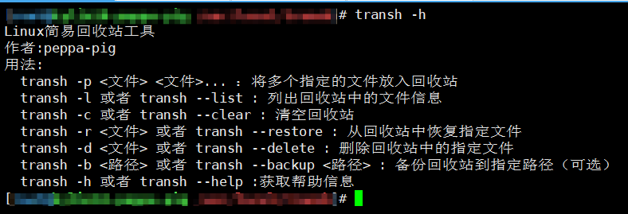

# 一、 先谈谈为啥我要开发这个东西？

  我是在学习运维的时候发现rm操作比较危险的操作，就想着开发一款适用于Linux回收站的功能 ，可以实时将文件进行回滚，在紧急关头挽回程序员的命。回收站也会支持数据的实时备份、压缩存储等。

# 二、项目简介

目标实现的功能如下：:star:表示已经完成

|        功能        | 是否开发完毕 |
| :----------------: | :----------: |
|  将文件放入回收站  |    已完成    |
|      数据恢复      |  正在开发中  |
|     清空回收站     |    已完成    |
|   查看回收站内容   |    已完成    |
| 删除回收站指定内容 |              |
|   回收站数据备份   |              |
|   对数据进行压缩   |              |
|                    |              |

# 三、安装方法

```bash
# 3.1 将项目克隆到服务器
git clone https://github.com/peppapigya/transh.git
# 给start.sh赋予执行权限，最好切换到root用户
cd transh
sudo chmod +x start.sh
# 执行脚本，里面会将项目打包成编译软件，如果本地没有go环境会默认拉取1.25版本的go环境，如有需要可以自行修改{go_url}参数
./start.sh
# 执行完脚本之后运行transh -h或者transh --help
transh -h
```



显示以上信息，表明回收站安装成功！:smile:

# 三、使用方法

## 3.1 查看使用方法

```
transh -h
```

## 3.2 查看回收站内容

```
# tansh -l或transh --list
transh -l
```


## 3.3 将文件放入回收站

```
# 这里只能通过工具内置命令transh -p去将文件移动到回收站，后续可能会将mv的命令也会集成过来，大家敬请期待....
transh -p transh.zip
```


## 3.4 清空回收站

```
# 清空回收站，会将回收站的信息压缩放到~/.local/share/backup目录下，然后清空Transh下所有文件内容
transh -c
```


**其他的功能还在开发中大家敬请期待...**
